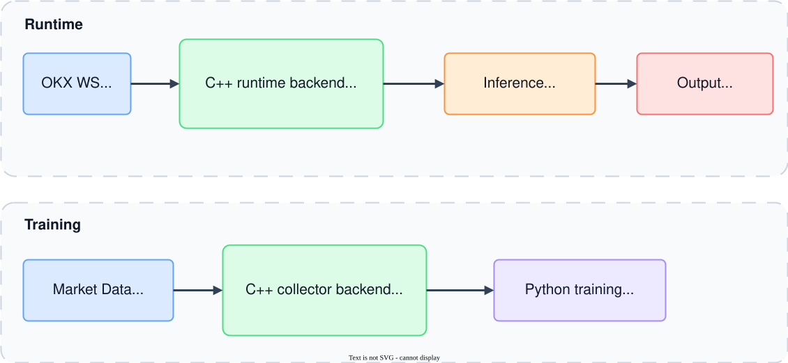

# OKX Trading Platform Sample

End-to-end trading stream playground with:
- C++ market stream bridge (OKX WebSocket -> gRPC stream)
- Electron desktop UI (multi-channel live view + simulator + local chart)
- Python ML pipeline (train/infer/prediction gRPC service)

## Architecture



Diagram files:
- `docs/architecture.drawio` (open/edit with draw.io)
- `docs/architecture.drawio.svg` (preview/export)

## Component Map

### 1) C++ stream backend
- File: `main.cpp`
- Connects to OKX WebSocket channels.
- Parses payloads with `simdjson` and normalizes fields.
- Computes per-tick `change` and `changed_fields`.
- Publishes ticks via gRPC `MarketData.Subscribe`.
- Handles graceful shutdown with signal handlers (`SIGINT`, `SIGTERM`).

Default server:
- `127.0.0.1:50051`

### 2) gRPC contracts
- File: `proto/market_data.proto`
- Services:
  - `MarketData.Subscribe(SubscribeRequest) returns (stream Tick)`
  - `PredictionService.Predict(PredictRequest) returns (PredictResponse)`
- `Tick` includes:
  - `ts`, `price`, `change`, `fields`, `changed_fields`

### 3) Electron desktop
- Files: `desktop/main.js`, `desktop/renderer.js`, `desktop/index.html`, `desktop/styles.css`
- `main.js`:
  - Connects to C++ gRPC stream
  - Supports multiple subscriptions (`channel + symbol` rows)
  - Batches points to renderer for smoother UI
  - Connects to Python `PredictionService` gRPC
- `renderer.js`:
  - Displays per-channel change cards
  - Maintains local series per `channel:symbol`
  - Draws local gRPC chart (UTC time axis)
  - Runs auto-trading simulation (buy/sell/hold loop)
  - Tracks account state: `cash`, `equity`, `lastAction`

### 4) Python ML pipeline
- Folder: `ml_pipeline/`
- Training:
  - `train_model.py` (linear)
  - `train_better_model.py` (tree, recommended baseline)
  - `train_lstm_model.py` (sequence model)
- Serving:
  - `prediction_server.py` loads `.json`, `.joblib`, or `.pt` and serves gRPC
- Utilities:
  - `collect_ticks_from_grpc.py` to collect trades + order-book rows from live stream
  - `build_realtime_features.py` to build real-time style feature rows
  - `create_future_labels.py` to create future-Δt supervised labels
  - `simulate_strategy.py` with `market_making` and `short_term_alpha` modes
  - `predict_client.py` for direct prediction smoke test

## Runtime Data Flow

1. C++ subscribes to OKX channels and receives live updates.
2. C++ parses/normalizes and emits `Tick` on gRPC stream.
3. Electron main subscribes to one or more `channel:symbol` streams.
4. Renderer updates stats/cards/charts by channel.
5. For inference, renderer sends recent points to Electron main.
6. Electron main calls Python `PredictionService.Predict`.
7. Prediction response feeds simulator decision logic (`BUY/HOLD`, horizon-based sell/re-entry).

## Suggested Startup Order

1. Build/run C++ stream server (port `50051`).
2. Start Python prediction server (port `50061`).
3. Start Electron app and connect stream.
4. Enable auto-trading in UI with horizon >= 1s.

## Quick Commands

### C++ backend
```bash
cmake --build --preset build-debug-osx -j
./build/osx/debug/bin/hello_world --grpc-port 50051
```

### Python prediction server
```bash
cd ml_pipeline
python3 -m venv .venv
source .venv/bin/activate
pip install -r requirements.txt
python prediction_server.py --model ../models/pulse_lstm_v1.pt --host 127.0.0.1 --port 50061
```

### Electron app
```bash
cd desktop
npm install
PRED_GRPC_TARGET=127.0.0.1:50061 npm start
```

## Notes

- If `PredictionService` is down, inference calls fail with `UNAVAILABLE` (connection refused).
- If stream stop is intentional, client-side `CANCELLED` from gRPC should be treated as normal shutdown noise.
- For lower UI latency, keep subscription set focused (avoid unnecessary channels per session).
