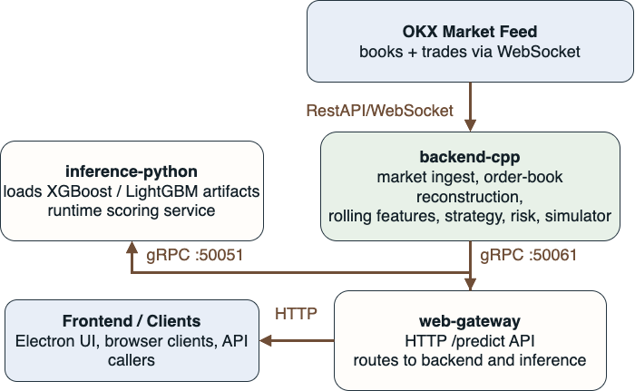
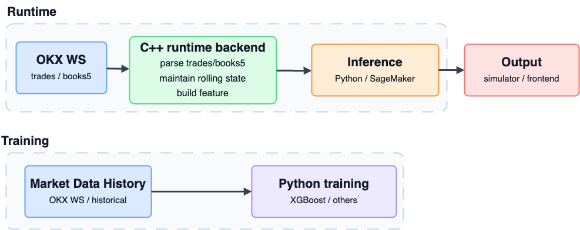
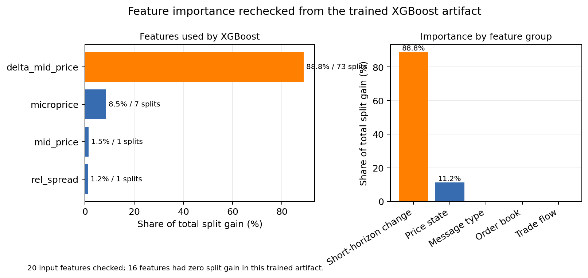
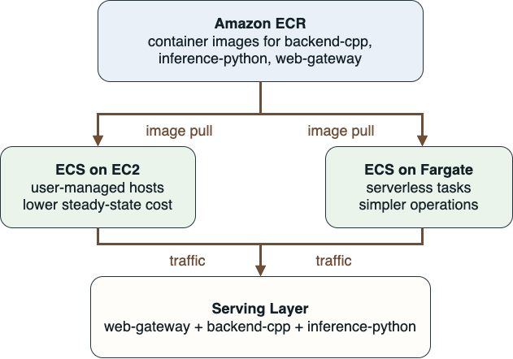

## 1. Executive Summary

OKX Pulse is a real-time trading signal inference platform built around OKX market data. The project separates the latency-sensitive online trading path from the offline training path:

- `backend/`: C++ market-data ingestion, feature generation, inference client, strategy logic, and paper-trading runtime
- `ml_pipeline/`: Python data preparation, labeling, model training, evaluation, and inference serving
- `frontend/electron/`: desktop operator interface
- `deploy/`: Docker, ECS, EC2, and Terraform deployment assets
- `docs/`: supporting architecture, data-contract, feature, and deployment notes

The main project decision was to predict executable trading edge instead of raw future price direction. This makes the task harder, but it aligns model evaluation with realistic crossed-spread profitability.

---

## 2. Runtime Architecture

The core decision loop stays on the local `backend-cpp -> inference-python` path so the latency-sensitive runtime does not depend on remote services.



| Service | Stack | Role | Interface |
| --- | --- | --- | --- |
| `backend-cpp` | C++ | market ingest, features, strategy, risk | `gRPC :50051` |
| `inference-python` | Python | model loading and scoring | `gRPC :50061` |
| `web-gateway` | Node.js | external API and routing | `HTTP :8080` |

Runtime flow:

1. `backend-cpp` subscribes to OKX WebSocket market data.
2. The C++ feature builder maintains online order-book and trade-flow features.
3. `backend-cpp` calls `inference-python` over internal gRPC for model scoring.
4. The strategy and paper-trading runtime consume predictions and stream output.
5. `web-gateway` exposes HTTP routing for external clients and UI access.

Primary code references:

- C++ runtime entrypoint: `backend/apps/market_data_main.cpp`
- Market stream: `backend/src/market_data/market_stream.cpp`
- Feature builder: `backend/src/features/feature_builder.hpp`
- Prediction client: `backend/src/inference/prediction_client.cpp`
- Python serving: `ml_pipeline/serving/app.py`
- Service contract: `backend/proto/market_data.proto`

---

## 3. Labeling and Features

The project predicts executable edge rather than raw future direction.



---

For horizon `H`, evaluate whether a crossed-spread trade would have been profitable.

**Buy edge**

$$
\text{buy\_pnl}_H = \text{bid}_H - \text{ask}_{now}
$$

**Sell edge**

$$
\text{sell\_pnl}_H = \text{bid}_{now} - \text{ask}_H
$$

$$
\text{label}_H =
\begin{cases}
1 & \text{if } \text{buy\_pnl}_H > \epsilon \ \text{and} \ \text{buy\_pnl}_H > \text{sell\_pnl}_H \\
-1 & \text{if } \text{sell\_pnl}_H > \epsilon \ \text{and} \ \text{sell\_pnl}_H > \text{buy\_pnl}_H \\
0 & \text{otherwise}
\end{cases}
$$

- `1`: executable long edge
- `-1`: executable short edge
- `0`: no clear edge

Main feature groups are shared between the online C++ runtime and the offline Python pipeline:

- price state: `mid_price`, `spread`, `rel_spread`, `microprice`
- order-book pressure: `imbalance_l1`, `imbalance_l5`
- trade flow: `trade_volume`, `trade_imbalance`
- short-horizon changes: `delta_mid_price`, `delta_spread`, `delta_imbalance_l5`

Supporting files:

- `docs/feature_definitions.md`
- `docs/data_contracts.md`
- `ml_pipeline/features/common.py`
- `ml_pipeline/data/build_labels.py`

---

## 4. Model Results

These signals repeatedly appeared near the top of the learned importance ranking.



| Metric | Value |
| --- | ---: |
| Rows | `86,399` |
| Columns | `43` |
| Train rows | `69,119` |
| Test rows | `17,280` |
| Split | chronological `80 / 20` |

The dataset is heavily neutral, which makes profitable edge detection harder than direction classification alone.

| Label | Train | Test |
| --- | ---: | ---: |
| `down` | `6,341` | `2,159` |
| `neutral` | `56,176` | `13,226` |
| `up` | `6,602` | `1,895` |

---

Neither final model achieved positive held-out executable PnL on the test set.

| Model | Threshold | Trades | Coverage | PnL / BTC | PnL / $5k | Win Rate |
| --- | ---: | ---: | ---: | ---: | ---: | ---: |
| `XGBoost` | `0.3 bps` | `691` | `3.999%` | `-295.6` | `-20.76` | `29.23%` |
| `LightGBM` | `0.5 bps` | `248` | `1.435%` | `-604.7` | `-42.53` | `23.79%` |

Interpretation:

- The model found repeatable structure in order-book and trade-flow features.
- The learned signal was not strong enough to overcome spread and execution costs on the held-out test split.
- This result supports continuing with executable-PnL labels rather than switching to easier raw direction labels.

---

## 5. Deployment Recommendation

- `ECS on EC2`: best for lowest steady-state cost
- `ECS on Fargate`: best when simpler operations matter more than cost



| Option | Best Use | Strength | Limitation |
| --- | --- | --- | --- |
| `ECS on EC2` | always-on runtime | lowest cost and most control | host management required |
| `ECS on Fargate` | simpler containers | no host management | higher steady-state cost |

| Platform | Shape | Cost View |
| --- | --- | --- |
| `ECS on EC2` | `3 x t4g.small` | `~$36.79 / month` |
| `ECS on Fargate` | `3 services` | `~$90.10 / month` |
| `ECR` | `11.9598 GiB` stored | `~$1.20 / month` |

Deployment references:

- Docker Compose: `deploy/containers/docker-compose.yml`
- ECS scripts: `deploy/ecs/`
- EC2 scripts: `deploy/ec2/`
- Deployment notes: `docs/deployment.md`
- EC2 vs Fargate appendix: `docs/aws_ec2_vs_fargate_comparison.md`

---

## 6. How to Run

Local container runtime:

```bash
docker compose -f deploy/containers/docker-compose.yml --profile runtime up --build
```

Local Electron UI:

```bash
cd frontend/electron
npm install
npm start
```

Create a clean submission zip:

```bash
scripts/prepare_submission.sh
```

The generated package is written to `submission/`.

---

## 7. Final Takeaways

- Keep the live decision loop local and low-latency.
- Continue training against executable PnL, not raw direction.
- Use `ECS on EC2` for cost-efficient always-on serving.
- Use `Fargate` when ease of operations matters more than cost.
- Keep online C++ features and offline Python training columns aligned to avoid train/serve drift.

---

## References

- [BinanceQuantTrader (GitHub)](https://github.com/vinadevs/BinanceQuantTrader)
- [OKX API Documentation (v5)](https://www.okx.com/docs-v5/en/)
- [OKX Historical Data](https://www.okx.com/en-us/historical-data)
